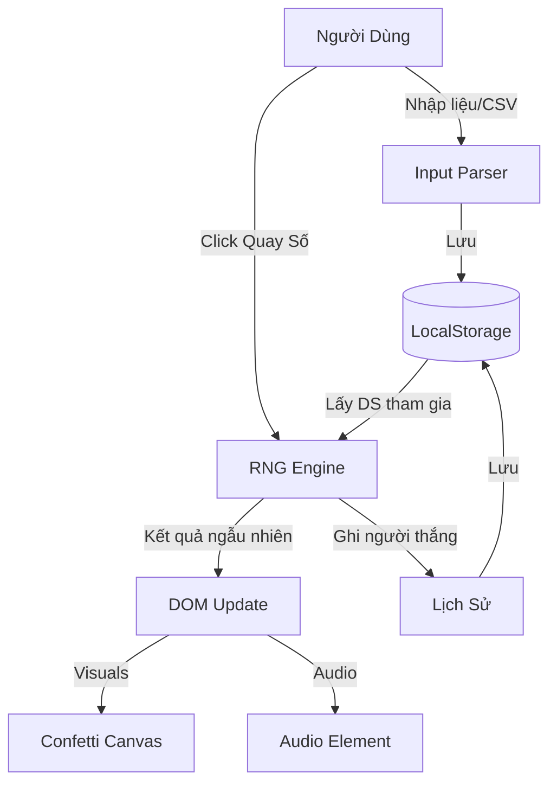

# 🎲 Lucky Draw Pro (Quay Số May Mắn)

  

> **Chọn người thắng cuộc một cách công bằng, thú vị và chuyên nghiệp.**

**Lucky Draw Pro** là một ứng dụng web đơn trang (Single-File Solution) được thiết kế để quản lý việc quay số trúng thưởng cho các sự kiện, tiệc công ty hoặc hoạt động lớp học. Với kiến trúc Zero-Dependency, ứng dụng hoạt động mượt mà trên mọi trình duyệt mà không cần cài đặt phức tạp.


-----

## 📑 Mục Lục

1. Giới Thiệu
2. Tính Năng Chính
3. Kiến Trúc Tổng Quan
4. Cài Đặt
5. Hướng Dẫn Sử Dụng
6. Cấu Hình (Configuration)
7. Cấu Trúc Thư Mục
8. Hướng Dẫn Đóng Góp
9. Giấy Phép
10. Lộ Trình Phát Triển (Roadmap)

-----

## 🚀 Giới Thiệu

Trong các sự kiện, việc chọn ra người may mắn cần sự minh bạch và yếu tố giải trí. **Lucky Draw Pro** giải quyết vấn đề này bằng cách cung cấp một giao diện trực quan, hiệu ứng pháo giấy (confetti) rực rỡ và khả năng cấu hình linh hoạt ngay trên trình duyệt của người dùng.

Dự án được xây dựng dựa trên triết lý **"Local-First"**: mọi dữ liệu về người tham gia, lịch sử thắng cuộc và cấu hình đều được lưu trữ an toàn trong trình duyệt của bạn (LocalStorage), đảm bảo quyền riêng tư và khả năng hoạt động offline.

-----

## ✨ Tính Năng Chính

  * **🎯 Quản Lý Vòng Quay:** Tùy chỉnh tên các vòng quay (Giải Nhất, Giải Đặc Biệt...) dễ dàng.
  * **👥 Nhập Liệu Linh Hoạt:**
      * Nhập thủ công qua khung soạn thảo.
      * Hỗ trợ **Import CSV** và Drag & Drop file danh sách.
  * **🎉 Hiệu Ứng Visual Đỉnh Cao:**
      * Animation quay số hồi hộp.
      * Hiệu ứng pháo giấy (Confetti) render bằng HTML5 Canvas khi có người thắng.
      * Hiệu ứng âm thanh chúc mừng.
  * **💾 Persist Data (Lưu Trữ Bền Vững):** Tự động lưu trạng thái, lịch sử và cấu hình vào LocalStorage. F5 không mất dữ liệu.
  * **📱 Responsive & Fullscreen:** Tối ưu cho màn hình máy chiếu (Projector) và thiết bị di động. Chế độ toàn màn hình giúp tập trung sự chú ý.
  * **⚙️ Cấu Hình UI:** Thay đổi tiêu đề, mô tả trực tiếp trên giao diện mà không cần sửa code.

-----

## 🏗 Kiến Trúc Tổng Quan

Dự án tuân theo mô hình **Vanilla MVC (Model-View-Controller)** giản lược, tích hợp toàn bộ trong một file duy nhất để tối đa hóa tính di động.

### Luồng Dữ Liệu (Data Flow)



### Thành Phần Kỹ Thuật

  * **Core:** HTML5, Vanilla JavaScript (ES6+).
  * **Styling:** CSS3 Variables, Flexbox, Grid Layout.
  * **Persistence:** `window.localStorage`.
  * **Rendering:** DOM Manipulation trực tiếp & Canvas API.

-----

## 📥 Cài Đặt

Vì đây là giải pháp **Single-File**, quá trình cài đặt cực kỳ đơn giản.

### Cách 1: Tải trực tiếp

1.  Tải file `index.html` từ repository này.
2.  Lưu vào thư mục máy tính của bạn.

### Cách 2: Clone Repository

```bash
git clone https://github.com/lamkent00/Lucky-Draw-Pro.git
cd Lucky-Draw-Pro
```

-----

## ▶️ Hướng Dẫn Sử Dụng

### 1\. Khởi chạy

Chỉ cần mở file `index.html` bằng bất kỳ trình duyệt hiện đại nào (Chrome, Edge, Firefox, Safari).

> **Mẹo:** Để trải nghiệm âm thanh tốt nhất, hãy tương tác với trang web (click chuột) ngay khi mở để trình duyệt cho phép Autoplay Audio.

### 2\. Quy trình tổ chức quay số

1.  **Cấu hình:** Vào tab **"Cấu Hình"** để đặt tên chương trình và danh sách giải thưởng.
2.  **Nhập danh sách:** Tại tab Cấu Hình, nhập tên người tham gia hoặc upload file `.csv`.
3.  **Quay số:**
      * Chuyển sang tab **"Quay Số"**.
      * Chọn vòng quay (Ví dụ: Giải Nhất).
      * Bấm nút **Phóng to (⛶)** để trình chiếu.
      * Bấm **"QUAY SỐ"** và chờ đợi kết quả.
4.  **Xác nhận:** Bấm **"Ghi Nhận"** để lưu người thắng vào lịch sử và loại khỏi danh sách quay tiếp theo.

-----

## 🔧 Cấu Hình (Configuration)

### Cấu hình Môi Trường (Environment)

Mặc dù là file tĩnh, bạn có thể cần thay thế một số placeholder trong code trước khi deploy thực tế:

Tìm và thay thế các giá trị sau trong file `index.html`:

| Placeholder | Mô tả | Giá trị mặc định gợi ý |
| :--- | :--- | :--- |
| `[website_description]` | Meta description cho SEO | "Công cụ quay số may mắn..." |
| `[sound_effect_url]` | Link file âm thanh MP3 chiến thắng | `assets/win.mp3` hoặc URL online |
| `[initial_participants]`| Dữ liệu mẫu ban đầu | (Để trống nếu không cần) |

### Định dạng File CSV

File CSV để import cần có định dạng đơn giản, mỗi dòng là một tên:

```csv
Nguyễn Văn A
Trần Thị B
Lê Văn C
```

*(Không cần header, encoding UTF-8)*

-----

## 📂 Cấu Trúc Thư Mục

Dự án được giữ ở mức tối giản nhất có thể.

```
lucky-draw-pro/
├── index.html          # 🌟 The Core Application (Logic + UI + Style)
├── .gitignore
└── README.md           # Tài liệu dự án
```

-----

## 🤝 Hướng Dẫn Đóng Góp

Chúng tôi hoan nghênh mọi sự đóng góp để làm cho dự án tốt hơn\!

1.  **Fork** dự án.
2.  Tạo branch tính năng của bạn (`git checkout -b feature/AmazingFeature`).
3.  Commit thay đổi (`git commit -m 'Add some AmazingFeature'`).
4.  Push lên branch (`git push origin feature/AmazingFeature`).
5.  Mở một **Pull Request**.

### Tiêu chuẩn Code (Coding Standards)

  * Sử dụng Vanilla JS, hạn chế thêm thư viện ngoài (No jQuery, No React) để giữ tính portable.
  * CSS sử dụng biến (`var(--color-name)`) để dễ dàng theming sau này.
  * Comment rõ ràng các function logic phức tạp.

-----

## 📄 Giấy Phép

Dự án này được phân phối dưới giấy phép **MIT License**. Xem file `LICENSE` để biết thêm chi tiết.

-----

## 🗺 Lộ Trình Phát Triển (Roadmap)

  * [x] Chức năng quay số cơ bản & Animation.
  * [x] Import CSV & LocalStorage.
  * [x] Hiệu ứng Confetti & Sound.
  * [ ] **Export Lịch Sử:** Xuất danh sách người thắng ra file Excel/PDF.
  * [ ] **Themes:** Chế độ Dark/Light và các theme màu tùy chỉnh.
  * [ ] **PWA Support:** Cài đặt app trên Desktop/Mobile để chạy offline hoàn toàn như Native App.
  * [ ] **Server Sync:** (Tùy chọn) Đồng bộ dữ liệu real-time qua Firebase cho các sự kiện lớn.

-----

\<sub\>Được xây dựng với ❤️ và sự tỉ mỉ cho cộng đồng bởi Lam Kent.\</sub\>
